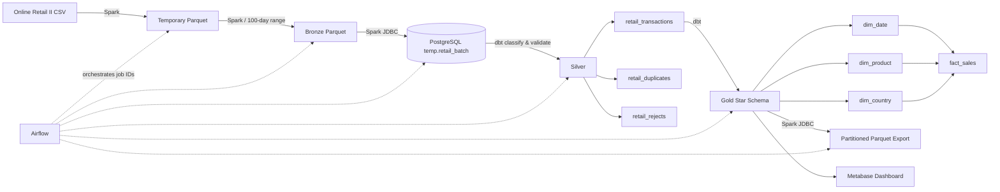
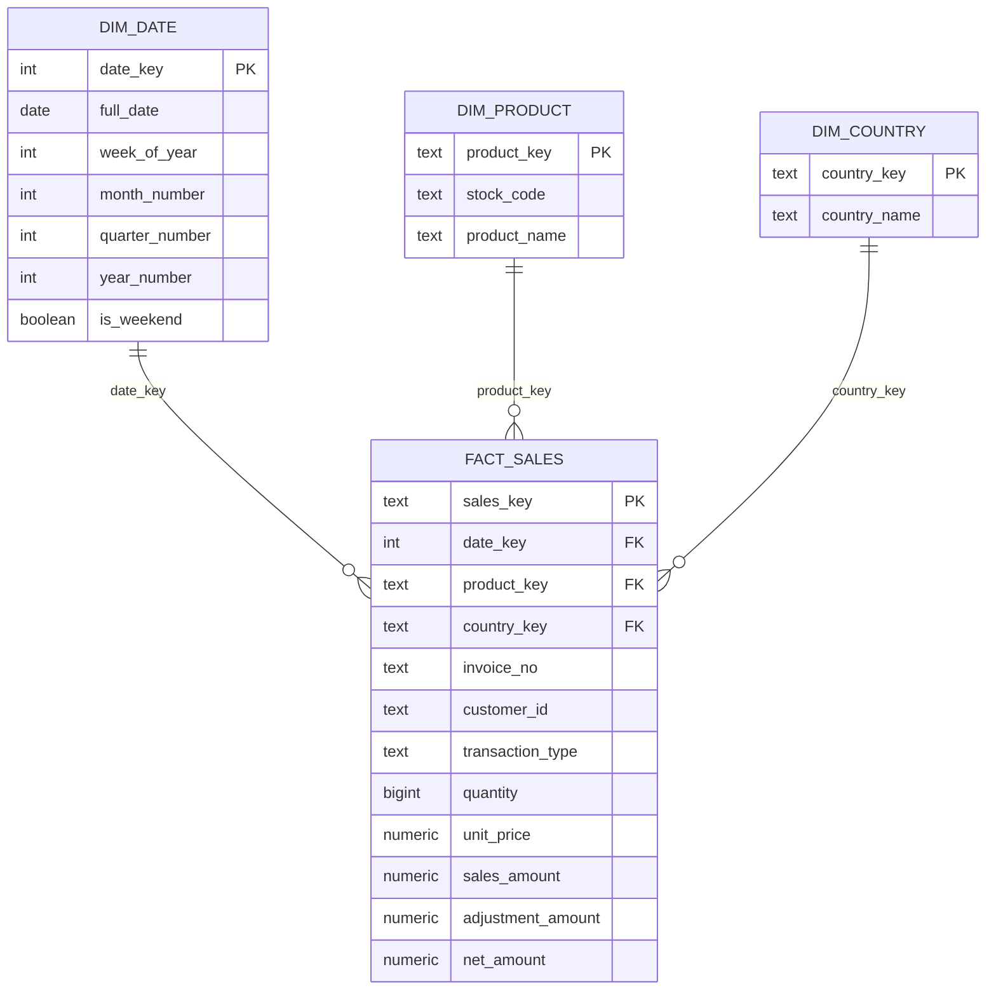

# Retail Medallion Analytics Pipeline

An end-to-end batch analytics engineering project that transforms the UCI **Online Retail II** dataset from raw CSV into a tested Medallion data lake, a PostgreSQL star schema, Parquet exports, and a Metabase sales dashboard.

The project demonstrates production-oriented data engineering patterns: date-range backfills, incremental loads, idempotent reruns, deterministic job ordering, data-quality quarantine, duplicate isolation, reconciliation, dimensional modeling, orchestration, and BI delivery.

## Project at a glance

| Result | Validated value |
|---|---:|
| Input rows processed (2009-12-01 to 2011-12-04) | **1,049,664** |
| Valid Silver transactions / Gold facts | **1,015,487** |
| Duplicate rows isolated | **34,172** |
| Rejected rows isolated | **5** |
| Distinct invoices | **52,991** |
| Distinct customers | **5,925** |
| Products in `dim_product` | **5,303** |
| Countries in `dim_country` | **43** |
| Active sales dates in `dim_date` | **599** |
| Gross sales | **£19,972,474.70** |
| Adjustments | **-£1,258,381.30** |
| Net sales | **£18,714,093.40** |

The measured range reconciles exactly:

```text
1,015,487 valid + 34,172 duplicates + 5 rejects = 1,049,664 input rows
```

## Architecture



## Pipeline flow and job ordering

Airflow exposes one task, `run_pipeline`, to keep the DAG view compact. Internally, the task splits a selected backfill range into **100-calendar-day batches** and logs progress as `batch=n/total`. Every batch executes the following IDs in ascending order; a larger ID always runs later.

| Job ID | Layer/group | Output or responsibility |
|---:|---|---|
| 100 | Bronze | Load the selected Temp Parquet range into date-partitioned Bronze Parquet |
| 200 | Temp | Load Bronze into `temp.retail_batch` through JDBC |
| 300 | Silver common | Apply shared typing, standardization, quality rules, classification and row ranking |
| 310 | Silver | Materialize `silver.retail_rejects` |
| 320 | Silver | Materialize `silver.retail_duplicates` |
| 330 | Silver | Materialize clean `silver.retail_transactions` |
| 340 | Silver QA | Reconcile source and Silver results |
| 400 | Gold dimension | Build `gold.dim_date` |
| 410 | Gold dimension | Build `gold.dim_product` |
| 420 | Gold dimension | Build `gold.dim_country` |
| 500 | Gold fact | Build `gold.fact_sales` |
| 510 | Gold QA | Run uniqueness, not-null and relationship tests |
| 600 | Export | Export Silver and Gold tables to partitioned Parquet |

Representative Airflow logs:

```text
PIPELINE START total_batches=8
BATCH START batch=3/8 range=2010-06-19..2010-09-26 days=100
JOB START batch=3/8 job_id=330 table=silver.retail_transactions
JOB SUCCESS batch=3/8 job_id=330 elapsed_seconds=...
BATCH SUCCESS batch=3/8 elapsed_seconds=...
```

If a command fails, the error marker includes the batch, exact date range, job ID, table and elapsed time.

## Incremental versus backfill

- **Incremental** processes newly arrived data only and accepts a range of up to 100 days. Example: load yesterday's transactions without rebuilding history.
- **Backfill** processes a historical range and automatically divides it into as many internal 100-day batches as required. The validated 734-day range produces eight internal batches while Airflow still displays a single task.
- Silver and Gold models delete only the selected date range before appending its replacement, making a rerun idempotent without deleting history outside that range.

Manual trigger example:

```json
{
  "mode": "backfill",
  "start_date": "2009-12-01",
  "end_date": "2011-12-04",
  "batch_days": 100
}
```

## Medallion design

### Landing and Bronze

- Reads all business fields as strings to preserve source fidelity.
- Normalizes only technical column names.
- Parses invoice timestamps for partitioning while retaining raw values.
- Creates a SHA-256 row hash for deterministic reconciliation and duplicate detection.
- Quarantines rows with unparseable invoice dates.
- Writes Snappy-compressed Parquet partitioned by invoice date.

### Silver

Shared logic lives in the ephemeral `int_retail_classified` model, while table-specific materialization is separated into three models:

- `retail_transactions`: typed, standardized, deduplicated business records.
- `retail_duplicates`: duplicate occurrences identified with `ROW_NUMBER()` over the row hash.
- `retail_rejects`: invalid records with explicit rejection reasons such as missing keys, invalid quantities, invalid dates, zero quantities or negative prices.

Transactions are classified as `SALE`, `RETURN`, or `CANCELLATION`; customers without an ID are retained as `GUEST` rather than silently discarded.

### Gold star schema



The grain of `fact_sales` is **one cleaned invoice line**. This supports flexible aggregation by date, product, and country without maintaining separate `daily_sales`, `daily_product_sales`, or `daily_country_sales` tables.

## OLAP or OLTP?

This is an **OLAP data platform**. It is optimized for analytical scans, aggregations, historical backfills, dimensional joins and dashboards. It is not an OLTP application: it does not serve individual checkout transactions or optimize frequent row-by-row inserts and updates. The source records represent operational sales events, but the resulting warehouse is structured for analysis.

## Data quality and reliability

- Required-column validation before ingestion.
- Invalid-date quarantine.
- Total-count and per-date reconciliation between Temp and Bronze.
- Two-way `exceptAll` row-hash reconciliation.
- Explicit reject reasons and a separate duplicate table.
- dbt not-null and unique tests for dimension/fact keys.
- dbt relationship tests from `fact_sales` to every dimension.
- Range-scoped replacement for safe, idempotent reruns.
- Database indexes on primary analytical join and filter keys.

## Analytics output

The Metabase `Retail Sales Overview` dashboard includes headline sales KPIs and analyses such as:

- gross, net and adjustment amounts;
- distinct orders and customers;
- top products by net sales;
- top countries by net sales;
- top 10 products by returned/cancelled units.

The last chart's version-controlled SQL is available at [`metabase/queries/top_10_returned_cancelled_products.sql`](metabase/queries/top_10_returned_cancelled_products.sql).

## Dataset

[Online Retail II](https://archive.ics.uci.edu/dataset/502/online%2Bretail%2Bii) is a real two-year transaction dataset for a UK-based non-store retailer that mainly sells giftware, with many wholesale customers. The complete UCI dataset contains 1,067,371 records from 2009-12-01 through 2011-12-09 and includes invoice, product, quantity, timestamp, price, customer and country fields. It contains missing values and cancellation records, making it useful for demonstrating realistic data-quality handling.

Dataset citation: Chen, D. (2012). *Online Retail II*. UCI Machine Learning Repository. DOI: [10.24432/C5CG6D](https://doi.org/10.24432/C5CG6D). Licensed under CC BY 4.0.

The raw dataset is intentionally excluded from Git. Download it from UCI, convert it to CSV if necessary, and place it at:

```text
data/landing_csv/online_retail_II.csv
```

## Tech stack

| Component | Role |
|---|---|
| Apache Airflow 3.3.1 | Orchestration, runtime parameters, retry and observability |
| Apache Spark 4.2.0 / PySpark | Distributed ingestion, Parquet processing and JDBC transfer |
| dbt-postgres 1.11 | SQL transformations, incremental models and tests |
| PostgreSQL 17 | Temp, Silver, Gold, control and audit schemas |
| Metabase | BI questions and dashboarding |
| Docker Compose | Reproducible local platform |
| Parquet + Snappy | Columnar data-lake storage and export |
| PowerShell | Optional local test runner and timing capture |

## Repository structure

```text
.
├── airflow/dags/                  # Airflow orchestration
├── dbt/retail_warehouse/
│   ├── macros/                    # Range-delete and schema macros
│   ├── models/silver/             # Shared and table-specific Silver logic
│   ├── models/gold/               # Star schema
│   └── tests/                     # Reconciliation tests
├── docker/                        # Airflow and dbt images
├── metabase/queries/              # Version-controlled dashboard SQL
├── scripts/                       # Local test/timing utilities
├── spark_jobs/                    # PySpark ingestion and export jobs
├── sql/init/                      # PostgreSQL bootstrap DDL
└── docker-compose.yml             # Local platform
```

## Run locally

### 1. Configure the environment

```powershell
Copy-Item .env.example .env
```

Edit `.env` and replace the example password. Never commit `.env`.

### 2. Add the source CSV

```text
data/landing_csv/online_retail_II.csv
```

### 3. Build and start the platform

```powershell
docker compose up -d --build
```

### 4. Convert the landing CSV once

```powershell
docker compose exec -T airflow /opt/spark/bin/spark-submit `
  --master spark://spark-master:7077 `
  /opt/pipeline/spark_jobs/00_csv_to_temp_parquet.py
```

### 5. Trigger the pipeline

Open Airflow, unpause `retail_medallion_pipeline`, select **Trigger DAG w/ config**, and provide an incremental or backfill date range.

## Local services

| Service | URL |
|---|---|
| Airflow | http://localhost:8080 |
| Spark master | http://localhost:8081 |
| Spark worker | http://localhost:8082 |
| Metabase | http://localhost:3000 |
| PostgreSQL | `localhost:5432` |

## Portfolio talking points

- Designed an ID-driven, dependency-ordered Medallion pipeline processing over one million retail rows.
- Implemented parameterized incremental and historical backfill workflows with 100-day internal batches.
- Built reusable Silver classification plus isolated clean, duplicate, and rejected datasets.
- Replaced fixed daily aggregates with a reusable OLAP star schema.
- Added count/hash reconciliation, dbt key tests, foreign-key tests and idempotent range reruns.
- Delivered business-facing Metabase KPIs and product/country/returns analysis.

## License and data attribution

Project code may be used for learning and portfolio review. The source dataset remains subject to the UCI Online Retail II CC BY 4.0 license and attribution requirements.
