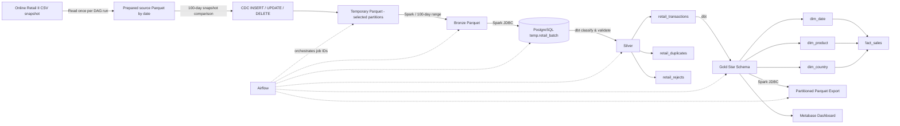
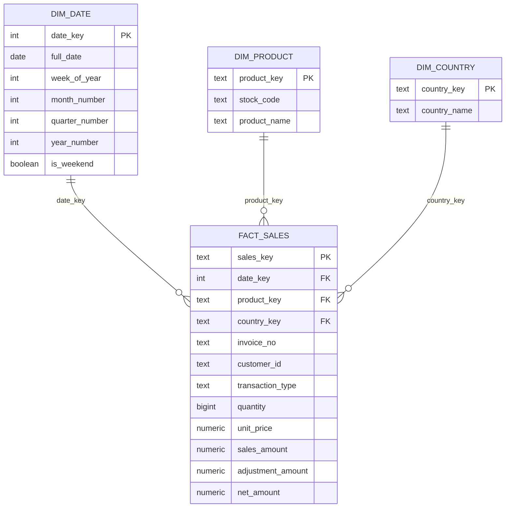

# Retail Medallion Analytics Pipeline

An end-to-end batch analytics engineering project that transforms the UCI **Online Retail II** dataset from raw CSV into a tested Medallion data lake, a PostgreSQL star schema, Parquet exports, and a Metabase sales dashboard.

The project demonstrates production-oriented data engineering patterns: full refreshes, snapshot-diff CDC, date-range backfills, incremental loads, idempotent reruns, deterministic job ordering, data-quality quarantine, duplicate isolation, reconciliation, dimensional modeling, orchestration, and BI delivery.

## Project at a glance

| Result | Validated value |
|---|---:|
| Input rows processed (2009-12-01 to 2011-12-09) | **1,067,371** |
| Valid Silver transactions / Gold facts | **1,033,031** |
| Duplicate rows isolated | **34,335** |
| Rejected rows isolated | **5** |
| Distinct invoices | **53,623** |
| Distinct identified customers | **5,942** |
| Products in `dim_product` | **5,304** |
| Countries in `dim_country` | **43** |
| Active sales dates in `dim_date` | **604** |
| Gross sales | **£20,476,260.45** |
| Adjustments | **-£1,462,050.61** |
| Net sales | **£19,014,209.84** |

The measured range reconciles exactly:

```text
1,033,031 valid + 34,335 duplicates + 5 rejects = 1,067,371 input rows
```

## Architecture



## Pipeline flow and job ordering

Airflow exposes one task, `run_pipeline`, to keep the DAG view compact. Internally, all three modes are split into **100-calendar-day batches** and log progress as `batch=n/total`. The CSV is prepared into date-partitioned Parquet once per DAG run; each batch then reads only its own partitions. Batch jobs execute in ascending ID order; a larger ID always runs later.

| Job ID | Layer/group | Output or responsibility |
|---:|---|---|
| 40 | Source prepare | Read the CSV once and create date-partitioned source Parquet |
| 50 | CDC | Compare one 100-day prepared-source range with committed state |
| 100 | Bronze | Replace only the affected date partitions, or rebuild all Bronze in full refresh |
| 200 | Temp | Load Bronze into `temp.retail_batch` through JDBC |
| 300 | Silver common | Apply shared typing, standardization, quality rules, classification and row ranking |
| 310 | Silver | Materialize `silver.retail_rejects` |
| 320 | Silver | Materialize `silver.retail_duplicates` |
| 330 | Silver | Materialize clean `silver.retail_transactions` |
| 340 | Silver QA | Reconcile source and Silver results |
| 400 | Gold dimension | Build `gold.dim_date` |
| 410 | Gold dimension | Build `gold.dim_product` |
| 420 | Gold dimension | Build `gold.dim_country` |
| 500 | Gold fact | Build `gold.fact_sales` |
| 510 | Gold QA | Run uniqueness, not-null and relationship tests |
| 550 | CDC commit | Commit the successful batch with PyArrow, without starting another Spark application |
| 600 | Final export | Export Silver and Gold once after every batch succeeds |

Representative Airflow logs:

```text
PIPELINE PLAN mode=full_refresh total_batches=8
SOURCE PREPARE SUCCESS target=.../source_snapshot
BATCH START batch=3/8 range=2010-06-19..2010-09-26 days=100
JOB START batch=3/8 job_id=330 table=silver.retail_transactions
JOB SUCCESS batch=3/8 job_id=330 elapsed_seconds=...
BATCH SUCCESS batch=3/8 elapsed_seconds=...
FINAL JOB SUCCESS job_id=600 table=silver_and_gold_parquet elapsed_seconds=...
```

If a command fails, the error marker includes the batch, exact date range, job ID, table and elapsed time.

## Full refresh, incremental and backfill

- **Full refresh** takes no date range. It resets managed targets once, prepares the CSV once, rebuilds Bronze/Silver/Gold in 100-day ranges, commits each successful range and exports once at the end.
- **Incremental** takes no date range. It prepares the current snapshot once and compares each 100-day range with committed state. Unchanged ranges skip downstream jobs and state rewrites. Within a changed batch, downstream jobs rebuild only the consecutive dates listed in the CDC manifest, so a one-day change does not rewrite the other 99 days; deleted dates are still propagated.
- **Backfill** divides the requested historical range into 100-day windows and deliberately rebuilds every selected window, even when source values match the CDC state.
- CDC state is committed only after downstream processing succeeds. A failed run therefore detects the same changes again on retry.
- Silver, Gold facts and Parquet exports replace exact affected dates, including dates that became empty after deletes.

Because the source is a CSV snapshot rather than a transactional database, CDC is implemented by snapshot comparison, not WAL/binlog capture. The synthetic record identity uses invoice number, stock code, invoice timestamp, customer ID and an occurrence number. Changes to non-identity fields are `UPDATE`; identity changes appear as a `DELETE` plus an `INSERT`.

Run `full_refresh` once when initializing the project so CDC has a complete baseline. Starting directly with incremental is supported, but every source row is then reported as an initial `INSERT` event.

### Verified one-row incremental test

An incremental validation changed only the description of invoice `489434`, stock code `85048`. CDC classified it as one update and narrowed the downstream work from a 100-day batch to one date:

```text
CDC MANIFEST ... affected_dates=["2009-12-01"]
change_counts={"delete":0,"insert":0,"update":1}
CHANGE WINDOW START batch=1/8 window=1/1 range=2009-12-01..2009-12-01
CHANGE WINDOW SUCCESS batch=1/8 window=1/1 range=2009-12-01..2009-12-01
```

During this validation, an Arrow/Spark timestamp precision mismatch was found on the first retry. The CDC writer now coerces committed timestamps to microseconds, which is compatible with Spark's vectorized Parquet reader. See [`docs/incremental_cdc_validation.md`](docs/incremental_cdc_validation.md) for the reproducible commands and verification queries.

CDC runtime data is stored under:

```text
data/cdc/state/retail_snapshot/       # last successfully committed snapshot
data/cdc/active/<run-token>/          # candidate snapshot and manifest
data/cdc/history/run_token=<token>/   # committed change events with before/after JSON
```

Manual trigger example:

```json
{
  "mode": "backfill",
  "backfill_start_date": "2009-12-01",
  "backfill_end_date": "2011-12-04",
  "batch_days": 100
}
```

Full refresh example:

```json
{
  "mode": "full_refresh"
}
```

Incremental CDC example:

```json
{
  "mode": "incremental"
}
```

## Medallion design

### Landing and Bronze

- Reads all business fields as strings to preserve source fidelity.
- Normalizes only technical column names.
- Parses invoice timestamps for partitioning while retaining raw values.
- Creates a SHA-256 row hash for deterministic reconciliation and duplicate detection.
- Quarantines rows with unparseable invoice dates.
- Writes Snappy-compressed Parquet partitioned by invoice date.

### Silver

Shared logic lives in the ephemeral `int_retail_classified` model, while table-specific materialization is separated into three models:

- `retail_transactions`: typed, standardized, deduplicated business records.
- `retail_duplicates`: duplicate occurrences identified with `ROW_NUMBER()` over the row hash.
- `retail_rejects`: invalid records with explicit rejection reasons such as missing keys, invalid quantities, invalid dates, zero quantities or negative prices.

Transactions are classified as `SALE`, `RETURN`, or `CANCELLATION`; customers without an ID are retained as `GUEST` rather than silently discarded.

### Gold star schema



The grain of `fact_sales` is **one cleaned invoice line**. This supports flexible aggregation by date, product, and country without maintaining separate `daily_sales`, `daily_product_sales`, or `daily_country_sales` tables.

## OLAP or OLTP?

This is an **OLAP data platform**. It is optimized for analytical scans, aggregations, historical backfills, dimensional joins and dashboards. It is not an OLTP application: it does not serve individual checkout transactions or optimize frequent row-by-row inserts and updates. The source records represent operational sales events, but the resulting warehouse is structured for analysis.

## Data quality and reliability

- Required-column validation before ingestion.
- Invalid-date quarantine.
- Total-count and per-date reconciliation between Temp and Bronze.
- Two-way `exceptAll` row-hash reconciliation.
- Explicit reject reasons and a separate duplicate table.
- dbt not-null and unique tests for dimension/fact keys.
- dbt relationship tests from `fact_sales` to every dimension.
- Range-scoped replacement for safe, idempotent reruns.
- Database indexes on primary analytical join and filter keys.

## Analytics output

The Metabase `Retail Sales Overview` dashboard includes headline sales KPIs and analyses such as:

- gross, net and adjustment amounts;
- distinct orders and customers;
- top products by net sales;
- top countries by net sales;
- top 10 products by returned/cancelled units.

Version-controlled Metabase SQL includes:

- [`monthly_sales_trend.sql`](metabase/queries/monthly_sales_trend.sql): monthly gross, adjustment and net-sales trends;
- [`country_sales_performance.sql`](metabase/queries/country_sales_performance.sql): country-level revenue, invoices and identified customers;
- [`product_adjustment_rate.sql`](metabase/queries/product_adjustment_rate.sql): product return/cancellation value and adjustment rate;
- [`top_10_returned_cancelled_products.sql`](metabase/queries/top_10_returned_cancelled_products.sql): products with the highest adjusted unit volume.

## Dataset

[Online Retail II](https://archive.ics.uci.edu/dataset/502/online%2Bretail%2Bii) is a real two-year transaction dataset for a UK-based non-store retailer that mainly sells giftware, with many wholesale customers. The complete UCI dataset contains 1,067,371 records from 2009-12-01 through 2011-12-09 and includes invoice, product, quantity, timestamp, price, customer and country fields. It contains missing values and cancellation records, making it useful for demonstrating realistic data-quality handling.

Dataset citation: Chen, D. (2012). *Online Retail II*. UCI Machine Learning Repository. DOI: [10.24432/C5CG6D](https://doi.org/10.24432/C5CG6D). Licensed under CC BY 4.0.

The raw dataset is intentionally excluded from Git. Download it from UCI, convert it to CSV if necessary, and place it at:

```text
data/landing_csv/online_retail_II.csv
```

## Tech stack

| Component | Role |
|---|---|
| Apache Airflow 3.3.1 | Orchestration, runtime parameters, retry and observability |
| Apache Spark 4.2.0 / PySpark | Distributed ingestion, Parquet processing and JDBC transfer |
| dbt-postgres 1.11 | SQL transformations, incremental models and tests |
| PostgreSQL 17 | Temp, Silver, Gold, control and audit schemas |
| Metabase | BI questions and dashboarding |
| Docker Compose | Reproducible local platform |
| Parquet + Snappy | Columnar data-lake storage and export |
| PowerShell | Optional local validation and timing utilities |

## Repository structure

```text
.
├── airflow/dags/                  # Airflow orchestration
├── dbt/retail_warehouse/
│   ├── macros/                    # Range-delete and schema macros
│   ├── models/silver/             # Shared and table-specific Silver logic
│   ├── models/gold/               # Star schema
│   └── tests/                     # Reconciliation tests
├── docker/                        # Airflow and dbt images
├── metabase/queries/              # Version-controlled dashboard SQL
├── scripts/                       # Local validation and timing utilities
├── spark_jobs/                    # PySpark ingestion and export jobs
├── sql/init/                      # PostgreSQL bootstrap DDL
└── docker-compose.yml             # Local platform
```

## Run locally

### 1. Configure the environment

```powershell
Copy-Item .env.example .env
```

Edit `.env` and replace the example password. Never commit `.env`.

### 2. Add the source CSV

```text
data/landing_csv/online_retail_II.csv
```

### 3. Build and start the platform

```powershell
docker compose up -d --build
```

### 4. Trigger the pipeline

Open Airflow, unpause `retail_medallion_pipeline`, select **Trigger DAG w/ config**, and choose `full_refresh`, `incremental`, or `backfill`. The DAG reads the landing CSV directly; the old one-time conversion step is no longer required.

## Local services

| Service | URL |
|---|---|
| Airflow | http://localhost:8080 |
| Spark master | http://localhost:8081 |
| Spark worker | http://localhost:8082 |
| Metabase | http://localhost:3000 |
| PostgreSQL | `localhost:5432` |

## Engineering highlights

- Designed an ID-driven, dependency-ordered Medallion pipeline processing over one million retail rows.
- Implemented automatic CDC incremental loads plus parameterized historical backfills with 100-day internal batches.
- Built reusable Silver classification plus isolated clean, duplicate, and rejected datasets.
- Replaced fixed daily aggregates with a reusable OLAP star schema.
- Added count/hash reconciliation, dbt key tests, foreign-key tests and idempotent range reruns.
- Delivered business-facing Metabase KPIs and product/country/returns analysis.

## License and data attribution

Project code may be used for learning and technical evaluation. The source dataset remains subject to the UCI Online Retail II CC BY 4.0 license and attribution requirements.
